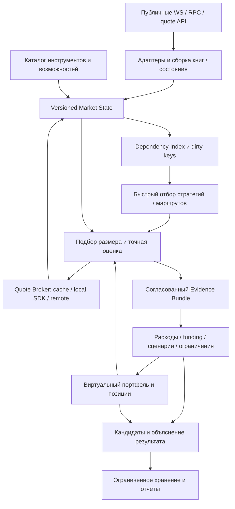
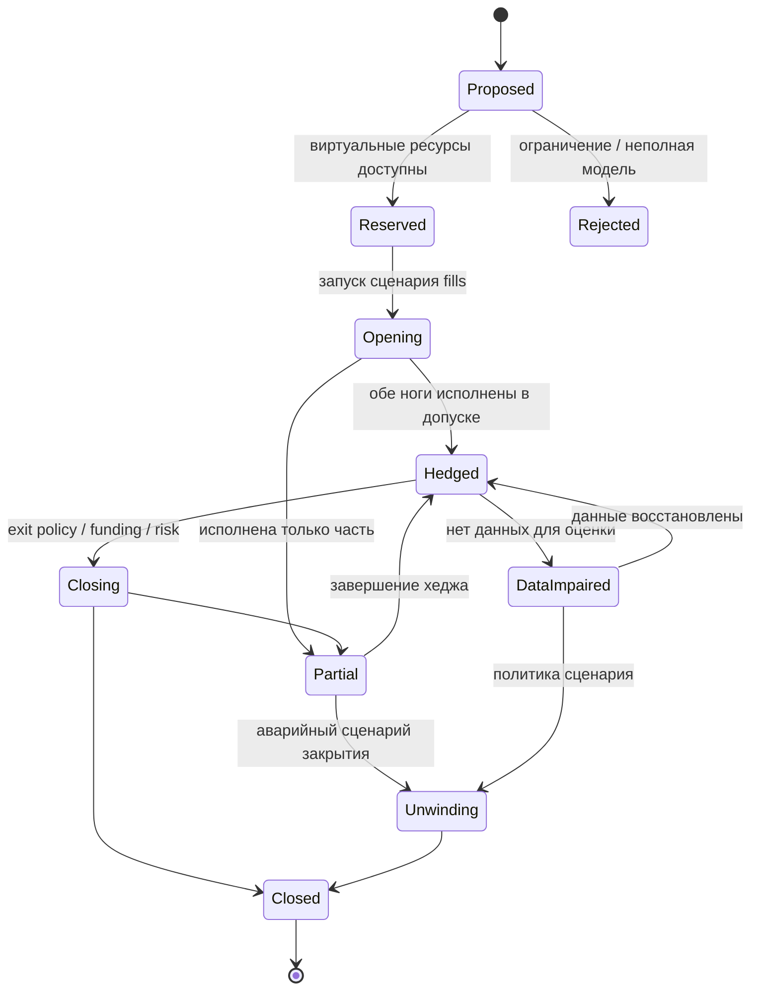

# Техническое задание: система поиска и проверки торговых возможностей CEX / DEX / perpetuals

Версия: 1.0. Дата: 8 сентября 2026 года. Проект: Crypto market-data lab.

Статус: проект целевой архитектуры и требований к реализации. Документ описывает будущие изменения; его создание не означает, что они уже внесены в работающий сканер.

Режим первой версии: публичные данные, опциональные явно настроенные read-only данные аккаунтов, виртуальный портфель, воспроизводимое моделирование. Отправка ордеров, заём средств, переводы, подпись и отправка транзакций в этот объём работ не входят.

Слова «обязательно» и «должен» обозначают требования приёмки. «Рекомендуется» — заменяемое проектное решение с сохранением требований. Численные параметры производительности и конфигурации ниже — предлагаемые стартовые значения для проверки, а не измеренные характеристики текущей системы и не лимиты поставщиков API.

Навигация: [текущее состояние](#2-исходное-состояние-и-обязательные-исправления-модели), [каталог стратегий](#3-экономические-классы-и-каталог-стратегий), [PnL](#4-учёт-количества-денег-и-pnl), [funding](#5-funding-borrow-и-календарь-удержания), [архитектура](#6-архитектура-системы), [DEX-котировки](#9-quote-broker-и-повторное-использование-dex-ответов), [поиск путей](#10-поиск-маршрутов-и-оптимизация-размера), [проверки](#18-проверки-и-критерии-приёмки), [план реализации](#19-план-реализации-и-миграции).

Термины: BBO — лучшие bid/ask и их объёмы; L2 — книга ценовых уровней; VWAP — средняя цена исполнения с учётом объёма; basis — разница цен связанных инструментов; delta — чувствительность портфеля к цене underlying; inventory — размещённые остатки активов; ledger — журнал финансовых изменений; numeraire — валюта сравнения результатов; evidence bundle — набор исходных данных и расчётов, подтверждающий конкретный результат.

## 1. Цель и ожидаемый результат

Система должна находить экономически осмысленные возможности среди доступных рынков, рассчитывать их на конкретный объём и объяснять, за счёт чего возникает результат: обменный спред, изменение базиса, funding, иной денежный поток. По каждой возможности нужны стоимость входа, способ и стоимость выхода, необходимый капитал, ограничения исполнения и проверяемые исходные данные.

Основной результат работы — ранжированный набор маршрутов и виртуальных позиций с доказательством расчёта. Число сравнений котировок, найденных расхождений и максимальный исторический спред сами по себе результатом торговли не являются.

Предлагаемая основа: единый сбор и versioned state, быстрый поиск по зависимостям, общий сервис точной стоимости и DEX-котировок, затем модель позиций с ledger и календарём funding. Spot-пути и позиции с деривативами используют общий слой исполнения и ресурсов, но разные экономические шаблоны.

Система должна отвечать на следующие вопросы:

1. Что именно купить, продать или открыть, на каких площадках и в каком количестве?
2. Какая часть результата уже следует из текущих котировок, а какая зависит от будущего?
3. Как изменятся деньги, токены, залог, обязательства и позиции после каждой операции?
4. Где находятся необходимые средства и можно ли использовать их в этом маршруте?
5. Как закрыть позицию, если спред сохранится, расширится или funding изменит знак?
6. Каков результат после комиссий, глубины, сетевых расходов, займа и ребалансировки?
7. Какие входные данные устарели или отсутствуют, и сколько стоит уточнить их?
8. Почему возможность прошла или не прошла проверку?

### 1.1. Границы охвата

«Все стратегии» в рамках проекта означает расширяемый каталог классов стратегий и поиск по зарегистрированным совместимым инструментам. Это не обещание перебрать все существующие блокчейны, токены, произвольные контракты и неограниченные последовательности сделок.

Первый полный релиз обязан покрывать spot↔spot, CEX↔DEX, DEX↔DEX, треугольные/короткие многошаговые обмены, spot↔perp и perp↔perp с базисом и funding. Поддержка конкретного маршрута зависит от подтверждённых возможностей его адаптеров. Отсутствующие возможности должны быть видны в отчёте о покрытии.

Обратные spot-стратегии с займом, торговля вокруг funding и перенос хеджа входят в модель и симулятор. При отсутствии данных о займе или правилах начисления они получают явный статус неполной модели. Срочные фьючерсы, maker-стратегии и LP-хеджирование описываются как последующие расширения с отдельными критериями допуска.

## 2. Исходное состояние и обязательные исправления модели

Основание этого раздела — чтение локального кода на дату документа. Это структурный аудит, а не повторная проверка живого процесса.

| Компонент | Что уже имеется | Что использовать в целевой системе |
| --- | --- | --- |
| `realtime_scanner.py` | Общие события, bounded bus, RAM-история, health и supervisor | Основа единого сбора, разделённые очереди данных и вычислительных уведомлений |
| `cex_book_streams.py`, `CexBookStateSource` | Локальные CEX-стаканы; полная доступная глубина отдельно от BBO-проекции | Единый сервис стоимости исполнения по глубине |
| `dex_quotes.py`, `polling_quote_sources.py` | Exact-input запросы; обычно 100 единиц stablecoin и обратный обмен полученного количества | Общий Quote Broker и повторное использование уже полученных котировок |
| `unified_cycle_analyzer.py`, `cex_dex_cycles.py` | Прямые inventory-маршруты; проход по CEX-глубине; треугольники | Перенос расчётов в общий слой исполнения и комиссии |
| `perp_venue_feeds.py` | Несколько perp-адаптеров; BBO, funding, mark/index и часть метаданных | Контракты instrument/funding/execution capabilities для каждого venue |
| `unified_perp_analyzer.py` | Сопоставления spot/perp/DEX; размер первого уровня; кандидаты | Источник требований и тестов, с переработкой PnL и жизненного цикла позиции |
| `perp_dex_monitor.py` | Более специализированная модель DEX↔Bybit, метаданные контрактов, FX и глубина | Переиспользовать проверенные функции, не запускать второй независимый сборщик |
| `solana_quote_worker.py`, `workers/solana-quote-worker` | Локальная работа с состоянием пулов и SDK | Изолированный вычислитель точных котировок по версиям состояния |
| `jupiter_gated_verifier.py` | Редкая проверка перспективных локальных сигналов | Встроить в общий бюджет провайдера |

### 2.1. Исправление прежних упрощений

**CUR-01.** Ветка CEX↔DEX уже использует доступную CEX-глубину. Нельзя переносить ограничение BBO perp-анализатора на всю систему.

**CUR-02.** Многие DEX-провайдеры уже возвращают обе стороны: `100 stable → q base`, затем `q base → stable`. Эти ответы могут быть пригодны для расчёта DEX↔perp без нового запроса. Текущий perp-анализатор обрабатывает стороны по отдельности и безусловно выставляет отсутствие полной модели выхода; это ограничение реализации.

**CUR-03.** В `_evaluate_dex_perp()` величина, названная `entry_cashflow_before_network_usdt`, включает условную стоимость perp-номинала. Открытие обычного маржинального perpetual не является получением/выплатой всей этой суммы, как при продаже/покупке spot. В новой схеме это только показатель входного базиса; денежные потоки, залог и PnL контракта учитываются отдельно.

**CUR-04.** `_funding_cashflow_per_hour()` нормализует общую ставку к часу, использует mark/BBO как ценовую базу и не применяет присутствующую отдельную short-ставку. Это допустимо лишь как грубая диагностическая проекция; для расчёта конкретной позиции требуются правила venue, сторона, календарь и правильная ценовая база.

**CUR-05.** Последовательное округление количества по шагу нескольких контрактов не гарантирует допустимость количества на всех площадках. Нужны пересечение решёток размеров или явная модель остаточного риска.

**CUR-06.** Паритет USDT/USDC и взаимозаменяемость BTC/обёрток не должны быть неявными. У каждой конверсии есть собственная стоимость, доступность и риск.

**CUR-07.** Текущий ограниченный журнал после заполнения перестаёт сохранять новые события. Для длительного исследования нужен бюджетируемый оборот сегментов и отдельные доказательства расчётов, без переписывания всего журнала каждые несколько секунд.

Эти пункты не доказывают ошибочность каждого старого сигнала. Они запрещают трактовать старые агрегаты как подтверждённую доходность новой модели.

## 3. Экономические классы и каталог стратегий

Площадка классифицируется двумя независимыми признаками: типом инструмента и механизмом исполнения. Perpetual может торговаться на CEX или DEX; DEX может иметь AMM, книгу заявок, RFQ или гибрид. Само слово DEX не определяет способ расчёта исполнения.

| ID | Стратегия | Действия и источник результата | Обязательные дополнительные данные |
| --- | --- | --- | --- |
| S01 | CEX spot↔CEX spot | Купить base на A, продать тот же net-base на B; межплощадочный обменный спред | Глубина обеих книг, комиссии, расположение инвентаря, FX и ребаланс |
| S02 | CEX spot↔DEX spot | Покупка на одной стороне и продажа на другой; точный результат DEX на выбранный объём | DEX exact quote/локальная симуляция, глубина CEX, сеть и токены |
| S03 | DEX↔DEX, одна сеть | Последовательные swaps; результат после всех обменов и gas | Последовательная симуляция общих пулов; возможность одной транзакции оценивается отдельно |
| S04 | Короткий многошаговый spot-маршрут | Обычно 3–4 обмена через base, bridge asset и settlement | Точные количества между шагами, промежуточные комиссии, общая ликвидность |
| S05 | Cross-chain / cross-venue inventory | Синхронные обмены заранее размещённых средств | Отдельная модель восстановления остатков; bridge не является мгновенным ребром |
| S06 | Long spot + short perp | Удержание хеджа; funding и изменение spot/perp-базиса | Две стороны исполнения, future-exit scenarios, funding, margin |
| S07 | Short spot + long perp | Отрицательный funding / обратный базис при продаже заёмного spot | Подтверждённый borrow, ставка, лимит, отзыв займа, возврат principal и процентов |
| S08 | Long perp A + short perp B | Изменение межперпового базиса и разность денежных потоков funding | Обе книги, контрактные множители, календарь каждого venue, отдельный залог |
| S09 | Funding-event capture | Вход/выход вокруг конкретных начислений при допустимом хедже | Правила eligibility, временна́я неопределённость, издержки четырёх торговых операций |
| S10 | Перенос существующего хеджа | Закрыть старую perp-ногу и открыть новую; улучшение будущего carry | Инкрементальный эффект против «ничего не менять», стоимость переключения |
| S11 | Spot↔dated future / календарный спред | Базис к экспирации, разность сроков | Дата/метод settlement, deliverable/cash-settled, календарь и правила контрактов |
| S12 | Maker + hedge | Вероятное maker-исполнение и taker-хедж | Модель очереди, adverse selection, частичные fills, отмены и maker fee |
| S13 | LP + delta hedge | Комиссии LP, изменение состава позиции, хеджирование | Состояние LP, путь цены, LVR/IL, rehedge и gas; отдельная исследовательская модель |

S01–S10 — обязательный каталог первого полного релиза. S11–S13 — расширения после приёмки базовых моделей; их нельзя объявлять поддержанными только потому, что доступны цены.

Дополнительная доходность collateral/lending/staking учитывается модулем carry, когда подтверждено, что данный залог действительно допускает такую доходность. Один и тот же актив нельзя одновременно считать потраченным на spot, заложенным на другом venue и размещённым в lending.

### 3.1. Условия завершения

У spot-inventory обмена итоговый общий base-инвентарь может сохраниться, но его расположение изменяется. Нужно показывать результат обмена и результат после восстановления заданных остатков отдельно.

У perp-стратегии после входа остаются открытые обязательства. Заработанный результат определяется ценами выхода, начислениями и расходами за время удержания. Perpetual не имеет срока, в который его базис обязан сойтись к нулю.

Продажа собственного spot с покупкой perp относится к управлению существующим инвентарём. Это не равнозначно открытию нового заёмного short spot: в сравнении нужен исходный портфель и выбранный benchmark.

## 4. Учёт количества, денег и PnL

### 4.1. Основной принцип

**ACC-01.** Источником истины является ledger изменений денег, активов, обязательств и позиций. Любая агрегированная формула должна сходиться с ledger на одних исходных данных.

Ledger хранит отдельно: свободные средства; зарезервированные средства; collateral; spot; долговое обязательство; perpetual quantity/entry cost basis; торговые комиссии; funding; проценты займа; gas; transfer fees; unclaimed/settleable/withdrawable PnL, если это различает протокол. Перемещение денег между своими свободными средствами и collateral не является расходом или прибылью.

**ACC-02.** Все исходные суммы сохраняются в native units. Цены и преобразования выполняются целочисленно или через Decimal с заданной точностью. Binary float запрещён для проверки лимитов, округления и финального PnL; допустим для визуализации и статистики.

**ACC-03.** Ставки хранятся с единицами: fraction, bps, ставка за период, за секунду или накопленный индекс. Например, 10 bps = 0.001; строка `0.01` без единицы и семантики не проходит нормализацию.

### 4.2. Spot

Обозначим $C_A(q,t)$ стоимость получения net-количества $q$ на A, а $R_B(q,t)$ поступления от продажи этого количества на B. Торговые комиссии и влияние объёма включены в эти функции согласно их явному fee breakdown.

Для inventory-обмена в единой расчётной валюте:

<tg-math-block>\Pi_{spot}(q)=R_B(q,t_B)-C_A(q,t_A)-G(q)-T(q)-H(q)</tg-math-block>

Здесь $G$ — дополнительные сетевые расходы, $T$ — выбранная стоимость восстановления размещения средств, $H$ — явно описанная поправка исполнения/остатка. Если $T$ неизвестна, сохраняются две величины: PnL обмена и `pnl_after_rebalance=null` с причиной. Нельзя молча подставить ноль и назвать результат полным.

Если CEX удерживает buy fee в base, требуется купить gross-количество, обеспечивающее нужное net-количество, и пройти глубину именно для gross-количества. Простое увеличение уже рассчитанной стоимости коэффициентом может пропустить переход на более дорогой уровень.

### 4.3. Linear perp: вход и выход

Для signed exposure $Q$ в base units, положительного у long и отрицательного у short:

<tg-math-block>\Pi_{perp}=Q(P_{exit}-P_{entry})+F-C_{trade}-C_{other}</tg-math-block>

Funding $F$ положителен для полученных средств и отрицателен для уплаченных. Контрактный multiplier применяется до получения $Q$. Цены исполнения берутся с правильной стороны книги и на нужный объём. Mark/index используются только по их назначению: риск, оценка, funding reference; они не заменяют доступную цену сделки.

Для long spot + short linear perp на одинаковое количество $q$, одной валюты и без ребалансирования количества обозначим $S$ цену spot, а $P$ цену perp:

<tg-math-block>\Pi=q(S_{exit}-S_{entry})+q(P_{entry}-P_{exit})+\mathrm{Funding}-\mathrm{Costs}</tg-math-block>

Если $b_t=P_t-S_t$, то $\Pi=q(b_{entry}-b_{exit})+\mathrm{Funding}-\mathrm{Costs}$. Это объяснение источника результата, а не допущение о будущем базисе. При объёмных DEX-котировках основная реализация использует итоговые суммы $C(q)$ и $R(q)$, а не усреднённую цену, линейно растянутую на другой объём.

Контрольный пример: куплен 1 токен на spot за 100, открыт short perp по 105. Немедленное закрытие по тем же ценам даёт ноль до комиссий, несмотря на входной базис 5. Если позднее spot продаётся по 110, а perp закрывается по 112, результат до расходов равен $10-7=3$. При funding +0.20 и общих расходах 0.40 итог равен 2.80 расчётной единицы.

Для long perp A + short perp B:

<tg-math-block>\Pi=q(P_{A,exit}-P_{A,entry})+q(P_{B,entry}-P_{B,exit})+F_A+F_B-Costs</tg-math-block>

Перенос всей величины $q(P_B-P_A)$ во входящие денежные средства запрещён.

### 4.4. Остальные контракты и валюты

Inverse, quanto, multiplier-контракты, prelaunch и иные специальные инструменты используют собственный `ContractModel`. Для обычного inverse с USD face value $V$ на контракт пример base-PnL long: $nV(1/P_{entry}-1/P_{exit})$. Это не универсальная формула всех деривативов: settlement currency, размер, delta, комиссии и collateral определяются спецификацией конкретного продукта.

Первый релиз полноценно оценивает подтверждённые linear-контракты. Остальные обязаны быть явно `unsupported_contract_model` до реализации и fixture-тестов соответствующего ContractModel; подмена их linear-моделью запрещена.

USDC, USDT, USD, bridged stablecoins и токены залога хранятся отдельно. Для денежного потока указываются native currency и оценка в numeraire по доступной стороне FX-книги/котировки. Расход и поступление не конвертируются одним mid без указания оценочного характера. Нельзя создавать прибыль простым предположением о равенстве разных stablecoins.

### 4.5. Обязательные виды результата

| Поле / смысл | Когда допустимо |
| --- | --- |
| `entry_basis_value` | Только показатель разницы цен при открытии |
| `spot_conversion_pnl` | Для полного плана spot-обменов с точными размерами |
| `liquidation_value_now` | Оценка немедленного закрытия уже открытого виртуального портфеля |
| `instant_roundtrip_cost` | Диагностическая стоимость входа и немедленного выхода |
| `projected_pnl_by_scenario` | Будущие выход, funding и расходы с явными допущениями |
| `paper_realized_pnl` | Закрытая виртуальная позиция и журнал смоделированных событий |
| `realized_pnl` | Только при read-only импорте подтверждённых реальных исполнений/начислений |

Unknown — это `null` и причина, а не нулевой расход. Расчёт прибыли не должен одновременно дважды вычитать уже включённые swap fees, price impact или trading fees. Haircut на будущую задержку отделяется от price impact объёма; slippage tolerance не является уже понесённой комиссией.

### 4.6. Капитал и нормализация

Показывать минимум: оборот каждой ноги, капитал в spot, collateral по venue, запас маржи, резерв gas, borrow principal и время удержания. ROI считается на явно определённый занятый капитал. Нормализация «на 100» — лишь дополнительный формат представления фактически проверенного размера; он не означает, что сделка на 100 возможна, если котировался другой объём.

Доходность на perp-margin без стоимости spot и резерва ликвидации не должна быть основным рейтингом. Инвентарь и залог на разных площадках не неттируются без подтверждённого общего margin domain. [Документация Hyperliquid по margin](https://hyperliquid.gitbook.io/hyperliquid-docs/trading/margining) показывает, почему режим счёта и доступность залога являются частью модели, а не только параметром цены.

## 5. Funding, borrow и календарь удержания

### 5.1. Контракт FundingModel

**FND-01.** Для каждого инструмента хранить:

- модель начисления: `discrete_event`, `continuous_accrual`, `cumulative_index` или `unknown`;
- signed cashflow convention и отдельные payer/receiver либо long/short rates, если они существуют;
- единицу ставки и исходный scale; reference price source и валюту платежа;
- интервал, ближайший известный event, расписание следующих событий и правила eligibility;
- момент публикации, локального получения, период действия прогноза и момент фактического расчёта;
- last settled rate отдельно от current/predicted rate;
- caps/floors, ограничения выплаты и версию правил;
- происхождение данных и статус проверки семантики.

Поля interval и next event должны обновляться независимо от цены. Жёстко заданный интервал допускается только как версионированная подтверждённая спецификация адаптера; неподтверждённое значение не должно повышать качество расчёта.

### 5.2. Расчёт конкретного горизонта

Для симметричной модели с положительной ставкой «long платит short» и signed base-position $Q$:

<tg-math-block>\mathrm{Funding}(t_0,t_1)=-\sum_{k\in\mathcal{E}(t_0,t_1)} Q_{eligible,k}\,P_{reference,k}\,r_k</tg-math-block>

Это формула только для соответствующей единицы ставки и linear-контракта. Множество $\mathcal E$ определяется правилами площадки и сценарием времени исполнения. Для side-specific/cumulative механизмов расчёт выполняется соответствующим адаптером, а не искусственным обращением знака общей ставки.

У Hyperliquid публичная документация описывает часовые выплаты и использование oracle price для расчёта funding notional. Поэтому универсальная подстановка mark price будет неверной даже при правильно нормализованной ставке. [Источник: Funding](https://hyperliquid.gitbook.io/hyperliquid-docs/trading/funding).

Данные Binance отдельно содержат изменения интервала и ограничений funding; в модели они должны быть метаданными инструмента. [Источник: Get Funding Rate Info](https://developers.binance.com/en/docs/catalog/core-trading-derivatives-trading-usd-s-m-futures/api/rest-api/market-data#get-funding-rate-info).

**FND-02.** Нормализация ставки к часу разрешена для сравнения на экране и предварительного отбора. Умножение этой нормализованной ставки на длительность позиции запрещено в финальном расчёте, если начисления дискретные.

Пример: virtual notional 10 000, ставка short-получения 8 bps раз в 8 часов, ближайший event в 16:00. Удержание с 15:30 до 16:30 при выполнении правил eligibility включает выплату 8 единиц, а не 1 единицу, полученную делением на восемь. Удержание с 16:01 до 17:01 не включает следующий восьмичасовой event. Ставка до event остаётся прогнозной, если площадка ещё не зафиксировала её.

**FND-03.** На границе event не предполагать, что отправленная за миллисекунду до него заявка уже открыла eligible position. Проверять интервал возможного fill time; неоднозначный случай считать отдельными сценариями «успели/не успели». При отсутствии вероятностной модели показывать диапазон, без выдуманной вероятности.

**FND-04.** Начисление, settlement и доступность для вывода могут быть разными событиями. Их нельзя объединять. Для cumulative funding хранить предыдущий применённый индекс и применять дельту один раз. Повторный импорт того же начисления обязан быть идемпотентным.

### 5.3. Прогноз и статистика

На заданные горизонты, первоначально 1, 4, 8 и 24 часа, а также до ближайших funding-events, вычисляются:

1. Текущая объявленная оценка ближайшего события.
2. Базовый сценарий следующих событий с явно указанным методом.
3. Неблагоприятный сценарий изменения ставки, базиса и ликвидности.
4. Порог funding/basis, при котором окупятся вход, выход, borrow и gas.

При наличии истории рассчитывать persistence знака, медиану, нижние/верхние квантили, фактические выплаты, ошибки предварительных прогнозов и корреляцию ставок двух ног. История должна быть доступна на момент решения; запрещена подстановка позднее опубликованной итоговой ставки в историческое решение о входе.

Для оценки устойчивости использовать event samples, а не считать каждый повтор одного funding ticker независимым наблюдением. При малом числе событий возвращать `insufficient_history`; APR/APY не выдаются за гарантированный доход, а APY без стратегии реинвестирования вообще не нужен.

Начальный baseline может быть простой и прозрачный: опубликованная ближайшая ставка плюс затухающая оценка следующих событий. Усложнение до ML допускается только после walk-forward проверки против baseline на фактических funding-events и затратах позиции.

### 5.4. Borrow

Модель займа хранит доступный размер, haircut залога, валюту/шкалу процентов, минимальный период начисления, возможность отзыва, лимит аккаунта и fees погашения. Проценты в заёмном активе увеличивают количество, которое придётся купить обратно; это влияет на цену выкупа и остаточную delta.

Публичная ставка без подтверждённой доступности займа даёт `borrow_capacity_unknown`. Продажу отсутствующего spot нельзя симулировать как обычную продажу собственного инвентаря. Возврат principal не является убытком; проценты и комиссии являются расходом.

## 6. Архитектура системы

### 6.1. Выбранная структура

Рекомендуется модульное приложение с одним владельцем нормализованного состояния и отдельными ограниченными worker-процессами для тяжёлых SDK/вычислений. На первом этапе не требуются Kafka, отдельный микросервис на стратегию или переписывание всех адаптеров. Процессные границы добавляются по результатам профилирования; публичные интерфейсы модулей позволяют сделать это без изменения экономической модели.



Связь `Quote Broker → State → evaluation` асинхронная. Запрос не выполняется внутри обработчика рыночного события. Завершение запроса возвращает новый versioned result, а дальнейший расчёт заново проверяет актуальность остальных зависимостей.

### 6.2. Владение данными и ответственность

| Модуль | Ответственность | Чего не делает |
| --- | --- | --- |
| Asset/Instrument Registry | Идентичность, contract model, fee/funding specs и capabilities | Не выводит совместимость из тикера |
| Collector Supervisor | Соединения, subscriptions, восстановление, rate-aware retry | Не знает торговых стратегий |
| State Builder / Book Store | Правильное применение deltas, атомарная публикация версий | Не теряет часть delta-последовательности ради скорости |
| Dependency Index | Связь изменения состояния с затронутыми расчётами | Не пересчитывает весь universe на каждом tick |
| Route/Strategy Engine | Формирование допустимых шаблонов и предварительный отбор | Не создаёт собственных сетевых соединений |
| Execution Cost Engine | Глубина, AMM, exact quantity, fees, FX | Не считает mark/TVL исполняемой ликвидностью |
| Quote Broker | Кэш, объединение запросов, общий бюджет, local/remote вызовы | Не подписывает и не отправляет транзакции |
| Funding/Carry Engine | Календарь, accrual, borrow, прогноз | Не смешивает прогноз и подтверждённые начисления |
| Portfolio/Position Engine | Виртуальные fills, ledger, риск, состояние позиции | Не расходует один и тот же капитал дважды |
| Evidence/Reporter | Доказательства, статус проверки, bounded persistence | Не превращает каждый market update в дисковую запись |

### 6.3. Три вычислительных этапа

**ARCH-01. Быстрый этап:** локальное изменение данных → обновление индексов → дешёвый отсев. На нём нет remote calls, блокирующего I/O, полного JSON-сериализования стаканов и полного перебора всех маршрутов.

**ARCH-02. Точная проверка:** оценка ограниченного числа перспективных размеров; получение недостающей глубины или DEX quotes через Broker; создание согласованного набора доказательств. Размер очереди и бюджет каждой стадии ограничены.

**ARCH-03. Удержание и выход:** позиции остаются объектами первого класса. Для уже открытых виртуальных позиций резервируется вычислительный и quote-бюджет на выход, даже если новые кандидаты выглядят привлекательнее.

### 6.4. Очереди и согласованность

Сборка книги получает все необходимые deltas в правильном порядке. Только после применения delta разрешается объединять уведомления о новой версии книги. Если потеря произошла до State Builder, книга становится invalid и требует восстановления.

После State Builder уведомление может быть `market_id is dirty`, а не копией каждого tick. Повторные уведомления объединяются; dirty key, обновлённый во время вычисления, обязан попасть в следующий проход. В очередях сохраняются отдельные приоритеты: контроль целостности; выходы; новые кандидаты; discovery; история/отчёты.

Цена/BBO может быть latest-wins. Funding-settlement, изменения позиции, fills и ledger — события, которые нельзя молча заменить последним значением. Они получают отдельный идемпотентный канал с гарантией записи либо явной остановкой соответствующей симуляции.

Компоненты читают immutable view состояния. Не допускается сборка одной книги из bids одной версии и asks другой. Глобальная атомарность разных бирж не предполагается: сохраняется вектор версий, возраст, задержки и качество временнóй согласованности.

## 7. Модели данных и идентичность

### 7.1. Registry

**DATA-01. AssetId:** `chain_namespace`, `chain_id`, contract/mint/native identifier, decimals, token program/standard, transfer-fee/hook flags, wrapper/redeem relationship. Native asset и его wrapper различаются, даже если возможна дешёвая конверсия.

**DATA-02. VenueAssetId:** учётный актив на конкретной площадке и сегменте аккаунта, связь с AssetId и подтверждёнными сетями ввода/вывода. Тикер является display label. Совпадение тикеров без проверенной связи не создаёт маршрут.

**DATA-03. InstrumentSpec:** stable instrument ID, venue, market type, base/quote/settlement, contract multiplier, price/quantity units, tick/lot/min/max notional, trading status, expiry, margin domain, funding model ID, risk tiers, oracle/index identity, spec version и observed time.

**DATA-04. CapabilityManifest:** поддержка L2/BBO/sequence/checksum, exact-in/exact-out, локального post-trade state, block pinning, quote expiry, RFQ firmness, funding history/forecast/indices, contract model, account fee lookup, borrow, gas estimate. Для каждого признака: `supported`, `unsupported` или `unknown`, доказательство и дата проверки.

Возможности SDK и реальные возможности подключённого endpoint — разные вещи. Версия package, protocol/program ID и endpoint generation фиксируются в manifest. Изменение семантики API по прежнему URL требует повторных contract tests.

### 7.2. Общая оболочка события

`EventEnvelope` содержит:

- `event_id`, `event_type`, `schema_version`, `source_id`, `source_epoch`, `instrument_or_pool_id`;
- exchange event time и его семантику, если известны;
- local receive UTC и monotonic, `boot_id`;
- source sequence / block number / block hash / slot / write version, если доступны;
- нормализованный payload и ссылку на spec version;
- quality flags, provenance, краткий безопасный диагностический текст.

Запросы quote дополнительно хранят start/end времени, RTT и время публикации в store. Время публикации не должно переименовываться во время получения ответа: иначе задержка очереди скрывается и старый ответ выглядит свежим.

### 7.3. Книга и пул

`BookState` хранит обе отсортированные стороны, версию, timestamps, native quantity units, известную глубину, признак покрытия и integrity status. Отсутствие более глубоких уровней означает неизвестность, а не нулевую ликвидность всего рынка. Цена zero/negative, crossed book, разрыв последовательности и потеря checksum делают соответствующую версию непригодной.

`PoolState` хранит protocol/version, точные AssetId, fees, reserves или ticks/bins, зависимости дополнительных accounts, version vector и качество chain consistency. TVL и reserve ratio пригодны для фильтрации, но не заменяют execution curve concentrated liquidity.

### 7.4. QuoteRequest и QuoteResult

| QuoteRequest | Назначение |
| --- | --- |
| `request_id`, `reason`, `priority`, `deadline_monotonic` | Планирование: discovery, candidate, exit, verification |
| `source_id`, chain, input/output AssetId | Точный объект котировки |
| `amount_raw`, `mode=exact_in/exact_out` | Точные единицы и направление |
| `required_state` / `minimum_state_quality` | Block pinning или требования свежести |
| route constraints, fee policy, slippage policy | Влияют на route и допустимые amounts |
| `dependent_candidate_ids` / `position_ids` | Объединение запросов нескольких потребителей |

`QuoteResult`: requested/actual input и output в raw units; net token movement; expected и min/max accepted amount отдельно; mode; fee breakdown с включённостью; route/pool identifiers; request/receive timestamps; block/slot и consistency; TTL/firmness; exactness; state-after capability; status/reason; request ID и versions.

Понятие `exact` означает точный размер вычисления при данных условиях. Оно не означает гарантированный fill или резервирование ликвидности.

### 7.5. Candidate, EvidenceBundle и Position

`Candidate` идентифицируется шаблоном, нормализованным маршрутом, направлением, account scenario и горизонтом. Оптимальный размер — версия оценки этого кандидата, а не новый независимый сигнал при каждом изменении на один lot.

`EvidenceBundle` содержит все точные amounts/quotes и версии зависимостей, путь расчёта затрат, funding-events, сценарии выхода, остаточные позиции, причины допусков/отказов, config/model/code version, hash содержимого. Нельзя оставить только итоговое число PnL.

`Position` содержит неизменяемые факты виртуального входа, фактическое смоделированное количество каждой ноги, open/close fills, funding index checkpoints, начисления, текущие обязательства, ограничения и exit policy. Новый сигнал на другом размере не изменяет уже открытую позицию.

## 8. Execution Cost Engine: стаканы, AMM, количество

### 8.1. Общий интерфейс

**EXE-01.** Каждый механизм исполнения предоставляет операции:

- `cost_to_acquire(net_quantity, state, fee_context) → ExecutionEstimate`;
- `proceeds_from_sell(gross_quantity, state, fee_context) → ExecutionEstimate`;
- `apply_virtual_fill(state, estimate) → post_state`, если поддерживается;
- `capacity(state, constraints) → известная допустимая область`.

`ExecutionEstimate` возвращает все движения токенов, среднюю/предельную цену, комиссии, использованные уровни/пулы, ограничения, остаток, version и quality. `partial`, `insufficient_depth`, `stale`, `unsupported`, `unknown` не преобразуются в полный fill.

### 8.2. L2 order book

Для покупки использовать asks по возрастанию цены, для продажи bids по убыванию. Суммировать стоимость реально потреблённых уровней до нужного количества. Prefix sums объёма и стоимости позволяют отвечать на запрос размера через поиск по накопленной глубине. Данные сохраняются в корректных base/contract units.

BBO пригоден для дешёвого отбора и точной оценки размера в пределах подтверждённого первого уровня. Если доступен только BBO и нужный объём больше него, ответ — `insufficient_known_depth`, а не линейная экстраполяция.

Книга восстанавливается по протоколу venue: snapshot + deltas, проверка sequence/checksum, resnapshot после разрыва. Например, официальный [алгоритм Binance](https://github.com/binance/binance-spot-api-docs/blob/master/web-socket-streams.md#how-to-manage-a-local-order-book-correctly) требует отбрасывать несогласованную локальную книгу после пропуска событий. Нельзя исправлять такой разрыв интерполяцией.

Публичная глубина является видимой ликвидностью; её знание не гарантирует исполнение. [Bybit отдельно описывает](https://bybit-exchange.github.io/docs/v5/market/orderbook) формат snapshot, количество/цену и отдельные timestamps/sequence. Адаптер должен сохранять их семантику.

### 8.3. AMM / concentrated liquidity / RFQ / гибрид

AMM использует проверенную формулу или официальный SDK с точным integer rounding, комиссиями и актуальным полным набором нужных accounts. CLMM/DLMM проходит ticks/bins до исчерпания входа; нехватка tick arrays не означает продолжение по последней цене.

Swap уже включает изменение цены от своего объёма. Slippage между запросом и включением в блок учитывается отдельно. Такое разделение следует из [описания swaps Uniswap](https://developers.uniswap.org/docs/get-started/concepts/traders/swaps).

У RFQ хранить quote ID, expiry, maker, размер, firmness, taker restrictions и требования исполнения. Indicative RFQ не повышается до firm quote. Публичная vAMM/oracle цена или DLOB-проекция не считается универсальным доступным BBO без подтверждения правил fill, oracle validity, auction/JIT и цены на нужный размер.

### 8.4. Общая ликвидность и последовательность

**EXE-02.** Если маршрут использует один пул/уровень несколько раз, последующие операции считаются на виртуально изменённом состоянии. Два aggregator-ответа, использующие один и тот же pool, не являются независимыми запасами ликвидности.

Особенно важно: два запроса `stable → q` и `q → stable`, выполненные без реальных swaps, обычно относятся к исходным рыночным состояниям. Они не являются автоматическим доказательством результата фактического последовательного roundtrip в одном пуле. Для такого утверждения нужна post-trade simulation. Без неё возможна отдельная оценка текущих сторон входа/ликвидации с соответствующей меткой, но не «атомарно исполнимый цикл».

Если маршрут скрывает pool IDs, выставлять `liquidity_overlap_unknown`. Атомарность подтверждается конкретным планом на одном execution domain; нахождение отрицательного цикла в ценовом графе её не подтверждает.

### 8.5. Общий размер и остаточная delta

**SIZE-01.** Размер выбирается в net exposure базового актива. После учёта decimals и multiplier каждый контракт имеет решётку допустимого количества. Для двух linear-площадок с точными рациональными шагами искать общую решётку через integer scale и НОК шагов. Пример шагов 0.03 и 0.02: общий шаг 0.06; последовательное округление к 0.04 недопустимо на первой площадке.

Все округления направлены консервативно: потребность в средствах вверх, доступное net-количество вниз, с последующей проверкой venue-specific округления и min/max constraints. Проверяются обе ноги и все промежуточные активы, не только конечный notional.

**SIZE-02.** Допускаются два явно разных режима:

1. `exact_neutral`: количества после комиссий и конвертации multiplier точно совпадают.
2. `bounded_residual`: хедж округлён, остаток сохранён как spot/exposure, его переоценка и выход включены в ledger; заданы абсолютный и относительный пределы delta.

DEX-ответ для фактических $q_{spot}$ можно использовать целиком, а perp открыть на допустимые $q_{perp}$. Для этого не требуется выдумывать новую DEX-котировку: разность учитывается как реальная виртуальная остаточная позиция. Линейно масштабировать сумму старого exact quote до $q_{perp}$ и скрывать остаток запрещено.

Если `exact_neutral` необходим, broker получает exact-output покупку нужного $q$ либо exact-input продажу этого $q$. После всех fees размер проверяется ещё раз.

## 9. Quote Broker и повторное использование DEX-ответов

### 9.1. Приоритет выбора данных

**QTE-01.** Порядок действий: подходящий свежий exact quote в кэше → локальная точная симуляция → общий remote quote API. Ни один strategy plugin не обращается к провайдеру самостоятельно.

Одна исходная ликвидность может обслуживать spot↔CEX, spot↔perp и несколько perp-venues. Если запросы совпадают по размеру и условиям, один in-flight request обслуживает всех потребителей. Количество стратегий не умножает сетевую квоту.

### 9.2. Использование существующей пары

Для уже полученной пары `100 stable → q base`, `q base → stable` проверить:

1. AssetId, chain, provider policy и фактические raw amounts.
2. Свежесть обоих ответов и их доступность на момент решения.
3. Версии состояния, временные интервалы и допустимость выбранного качества согласованности.
4. Exact/approximate/indicative semantics и все включённые fees.
5. Совпадение spot-размера с хеджем либо явно рассчитанный допустимый residual.

Если проверка прошла, пара используется без дополнительного remote запроса. Локальный `round_id` помогает связать ответы внутри source epoch, но не заменяет эти проверки. Одинаковый round ID у разных источников ничего не доказывает; разные round ID сами по себе не запрещают согласованный bundle, если подтверждены нужный объём и качество данных.

Для выхода из позиции спустя время котируется её фактическое количество, зафиксированное при входе. Выход по определению относится к новым данным и не обязан иметь round ID входа. Нельзя подменять выход новым количеством токенов, которое сейчас получилось бы за 100 stablecoins.

### 9.3. Динамические размеры

Обязательные операции Broker: `get_exact_input`, `get_exact_output`, `get_two_sided_for_quantity`, `revalue_position_exit` и `estimate_local_path`.

`get_exact_output` реализуется нативным endpoint/SDK при подтверждённой поддержке. Например, [Raydium Compute API](https://docs.raydium.io/api-reference/route-api-v2/overview) разделяет вычисления необходимого input и ожидаемого output; эти read-only вычисления отделены от построения и отправки транзакций.

Если есть только exact-input:

- предпочтителен размер, уже подтверждённый ответом;
- возможен bounded search необходимого input с проверкой фактического output;
- монотонный поиск применим только при подтверждённой монотонности и совместимом route; смена route/state требует повторной проверки;
- поиск имеет лимит запросов/времени; невыполнение лимита возвращает `exact_size_unavailable`, а не приблизительную «точную» цену.

Для одной новой candidate verification предлагается верхний предел 6 remote requests, включая обе стороны и уточнение размера; реальный лимит может быть меньше из-за provider budget/deadline. Этот предел не резервируется на каждый tick: задача создаётся после отбора и объединения запросов.

### 9.4. Ключи кэша и инвалидирование

Ключ: provider/endpoint generation, chain, input/output AssetId, raw amount, exact mode, route restrictions, fee/slippage policy, pinned block/state version либо TTL class. Для account/taker-dependent quotes дополнительно нужен несекретный context fingerprint.

Локальная детерминированная котировка инвалидируется при изменении любой account/pool/spec зависимости. Remote quote ограничивается TTL, chain freshness и price drift. Изменение perp BBO требует нового сравнения, но само по себе не требует нового DEX-запроса, если DEX quote ещё допустим.

Поздно пришедший ответ старого запроса не перезаписывает более новый пригодный результат. После ошибки нового quote старый успешный результат можно оставить для диагностики, но нельзя обновить его timestamp или скрыть истечение TTL. Нет ликвидности и устарело — разные причины.

### 9.5. Общий бюджет

**QTE-02.** Rate limiting строится по реальным quota domains: vendor/API key/IP/RPC account/endpoint class. Несколько классов Python, которые обращаются к одному vendor, используют общий budget manager. Учитывается вес HTTP/RPC вызовов, batch semantics и retry, а не только количество задач.

В конфигурации фиксируются допустимая частота, burst, concurrency, timeout, daily credits/cost ceiling и источник этих ограничений. Добавление market/source не должно увеличивать суммарную квоту. Платные тарифы или ключи не подключаются автоматически.

Стартовое распределение доступного quote-бюджета: 30% exits, 50% verification новых кандидатов, 10% exploration, 10% восстановления/обслуживания. Свободную долю разрешено временно использовать другим классам без вытеснения уже необходимого выхода. Перед запросом пары проверять бюджет и срок получения обеих сторон, чтобы не тратить квоту на заведомо непригодный bundle.

Очередь приоритетов учитывает потенциальный абсолютный результат, вероятность дожить до ответа при наличии статистики, требуемое число запросов, новизну данных и штраф за повтор. При отсутствии статистики использовать объяснимый детерминированный приоритет, не придумывать probability.

**QTE-03.** Freshness не ослабляется ради красивого количества кандидатов. Если бесплатный polling даёт котировку слишком редко для короткого спреда, маршрут отмечается `coverage_limited_by_quote_latency`. Варианты улучшения: уменьшить active universe, использовать local state, оптимизировать повторное использование или отдельно изменить тариф. Это должно быть видно в отчёте.

## 10. Поиск маршрутов и оптимизация размера

### 10.1. Три взаимосвязанные модели вместо одного ценового графа

**SEARCH-01. Cash graph.** Узел — `(asset_id, location, account_segment)`. Рёбра — реальные обмены, wrap/unwrap, доступные transfer/redeem действия с amounts, fees, временем и условиями. Численно одинаковый актив в разных кошельках — разные узлы.

**SEARCH-02. Position templates.** Открытие perp создаёт позицию и потребность в collateral. Оно моделируется преобразованием вектора состояния, а не обычным ребром «получить stablecoin за продажу base». Шаблон содержит open legs, hold events, exit legs, cashflows и resource requirements.

**SEARCH-03. Inventory/settlement graph.** Отдельный план поддержания остатков и вывода/bridging. Для одновременных cross-venue операций используется многовходовый план с заранее доступными ресурсами, а не фиктивный мгновенный перенос купленного base на другую площадку.

Это разделение позволяет использовать графовые алгоритмы для spot, шаблоны для деривативов и общую оптимизацию ресурсов для совокупного портфеля.

### 10.2. Предварительное построение маршрутов

На discovery/spec update:

1. Построить индексы по underlying identity, settlement, location, contract model и capabilities.
2. Исключить неизвестную эквивалентность, запрещённые/неактивные рынки и несовместимые модели.
3. Перечислить простые spot-пути до 4 swap-legs в первом релизе; transfer legs не добавляются к мгновенным путям.
4. Создать допустимые spot/perp и perp/perp templates по одинаковой экономической экспозиции.
5. Сохранить reverse dependency index: книга/пул/fee/funding/FX/inventory → затронутые routes/templates.
6. Канонизировать циклы и исключить дубли от разных стартовых узлов; оставить направления и реальные варианты исполнения раздельными.

Universe ограничивается конфигурацией и бюджетом. Планировщик не может бесконечно увеличивать число routes, keys или accounts в памяти.

### 10.3. Быстрый отбор на событиях

На price/depth event пересчитывать только затронутые группы. Funding-context и fee updates затрагивают свои зависимости, а не весь engine.

Для spot-пар поддерживать сортировки marginal buy cost / sell proceeds после известных fees. Для funding-пар — таблицы expected cashflow по стороне и горизонту с предварительной стоимостью входа/выхода. Нельзя отбирать funding только по входному спреду: стратегия может покрывать отрицательный spread положительным carry.

В небольшом активном наборе можно перечислять все совместимые пары, но только после coalescing и в затронутой группе. При росте universe использовать top-K и оптимистические границы; число запрошенных remote quotes должно зависеть от shortlist, а не от числа возможных пар.

Для spot-циклов веса $-\log(rate)$ допустимы как marginal screen. Они не учитывают конечный объём, fixed gas, lot sizes, route changes и общие pools. Отрицательный цикл — приглашение к проверке, не готовый результат. Полный Bellman–Ford на каждом рыночном tick не требуется; предпочтительны заранее перечисленные короткие циклы и dirty-edge update.

### 10.4. Безопасный отсев и эвристики

Отбрасывать путь по верхней границе прибыли разрешается только при доказанно оптимистичной границе в заданной области. BBO или mid API не считаются такой границей без условий о fee/rebate, исполнении и liquidity curve.

Проверенные monotone/concave pool models допускают математические bounds. Для агрегаторов со сменой route, динамических fees, RFQ и неизвестных hooks использовать эвристический рейтинг и явно отражать, что полнота поиска не доказана.

Бюджет exploration обязан периодически проверять маршруты вне текущего top-K, иначе система закрепит выборку только ранее успешных сигналов. В отчёте показывать total eligible, screened, exact-verified, deferred by budget и not-covered.

### 10.5. Подбор объёма

Цель — максимизировать абсолютный net PnL либо заданную риск-скорректированную величину при ограничениях ресурсов; максимальный процент на микроскопическом объёме не является автоматическим победителем.

Алгоритм:

1. Определить допустимый интервал количества по книгам, DEX capacity, лотам, min notional, inventory, margin и borrow.
2. Построить дешёвую сетку: например 25, 50, 100, 250, 500, 1000 единиц numeraire в пределах лимитов, плюс границы уровней CEX и значимые pool breakpoints.
3. На сетке использовать локальные модели; фиксированный quote на 100 является только одной точкой.
4. Уточнить лучшие области по абсолютному PnL и потребности в капитале. Для подтверждённых свойств кривой можно применять локальный поиск; произвольные aggregator routes не считать унимодальными.
5. Для shortlist запросить точные размеры через Broker, проверить все legs и пересчитать на свежих данных.
6. Вернуть лучший проверенный feasible size, соседние размеры и причину ограничения. Не заявлять глобальный optimum без доказательства.

Задача оптимизации имеет срок и бюджет итераций. При исчерпании времени возвращается лучшая подтверждённая оценка со статусом неполного поиска, а не блокируется сбор данных.

### 10.6. Общие ресурсы нескольких кандидатов

Отдельно от индивидуального рейтинга строится конфликтная модель: cash/inventory, collateral, borrow cap, pool/уровни ликвидности, max venue exposure и операции в одном execution domain.

Для виртуального портфеля в первом релизе достаточно детерминированного greedy allocation по проверенному рейтингу с повторным расчётом остаточной ликвидности и резерва средств. Оптимизация MILP/flow/knapsack допускается позднее, если замер покажет выигрыш. Складывать лучший PnL всех кандидатов как одновременно доступную прибыль запрещено.

### 10.7. Псевдокод

```text
on_valid_state_update(key, version):
    state.publish(key, version)
    dirty_groups.add(dependencies.groups_for(key))

evaluation_cycle():
    for group in fair_scheduler.take_dirty_groups():
        view = state.pin_view(group.dependencies)
        for plan in templates.shortlist(group, view, exploration_budget):
            bounds = plan.screen(view, funding_calendar, constraints)
            if bounds.has_proven_negative_upper_bound:
                record_rejection(plan, "unprofitable_upper_bound")
                continue
            sized_plan = size_optimizer.best_within_budget(plan, view)
            missing = sized_plan.required_quotes_not_in_cache()
            if missing:
                quote_broker.enqueue_coalesced(missing, deadlines)
                mark_pending(plan)
                continue
            evidence = verifier.build_and_check(sized_plan, latest_state)
            result = accounting.evaluate(evidence, exit_scenarios)
            candidate_store.upsert(result)

on_quote_result(result):
    accept_only_non_superseded_result(result)
    mark_dependent_groups_dirty()
```

Повторное вычисление ограничивается cooldown/version logic; `pending → quote_result → pending` без новых данных и без изменения объёма не должно создавать бесконечную цепочку запросов.

## 11. Проверка времени, целостности и качества

**TIME-01.** Возраст данных измеряется от реального local receive monotonic, а не от времени расчёта или перезаписи JSON. Exchange time используется отдельно с известной семантикой и оценкой неопределённости часов.

Для bundle нужны минимум: возраст каждой ноги, возраст funding/fees/spec, response/request intervals DEX, межноговый receive skew, queue delay и chain consistency. Малый skew двух одинаково старых ответов не делает их свежими.

Нужны разные TTL для типов данных и горизонтов: книга исполнения, remote DEX quote, oracle, funding forecast, instrument metadata. Более длинный горизонт funding не позволяет открыть позицию по старому стакану: допустимость входных цен проверяется отдельно от длительности carry.

**TIME-02.** Chain consistency имеет уровни: pinned consistent snapshot, validated multi-account snapshot, slot-window estimate, response-time-only, unknown. Один Solana slot не всегда доказывает единый атомарный read всех accounts; значения write version/context и способ получения хранятся. Если API не позволяет pin block, нельзя объявить эту возможность в result.

**TIME-03.** Истечение TTL само инициирует инвалидирование candidates и переоценку positions. Последний положительный ответ не должен оставаться активным до следующего market event, который может никогда не прийти.

После reconnect, reboot, clock discontinuity или resume из suspend состояние временно непригодно, пока не подтверждена непрерывность/свежесть. На Linux рекомендуется учитывать CLOCK_BOOTTIME либо сопоставление нескольких часов для обнаружения suspend; UTC jump не должен продлевать quote TTL. Monotonic из другого boot/process host нельзя сравнивать напрямую.

Долгое отсутствие изменения цены и отсутствие данных — разные состояния. Повышать freshness по обычному heartbeat нельзя без подтверждённой гарантии протокола, что книга остаётся полной и непрерывной; иначе нужны snapshot/revalidation или stale status.

**TIME-04.** Исторический replay использует as-of доступность: событие не может повлиять на решение до своего recorded receive time. Факт, опубликованный позже с более старым exchange timestamp, не подставляется задним числом.

### 11.1. Проверка необычно большого edge

Большой edge повышает приоритет проверки идентичности и качества, а не автоматически ранг доходности. Проверить mint/contract, multiplier, decimal scale, quote/settlement, mark-versus-executable, stale state, borrow/deposit restrictions и независимую цену. Аномалия может быть настоящей — её не следует безусловно удалять; она остаётся `anomaly_pending_verification` с диагностикой.

## 12. Виртуальный портфель и жизненный цикл позиции

### 12.1. Два режима исследования

`isolated_case`: каждый кандидат оценивается на отдельном гипотетическом наборе ресурсов. Результаты не суммируются как доход портфеля.

`portfolio_replay`: единый виртуальный портфель, общие ограничения, reservation и конфликт ликвидности. Только этот режим допускает расчёт общей доходности портфеля, drawdown и капиталоёмкости.

Режим всегда присутствует в отчёте. Если реальные read-only balances не настроены, использовать явно названный сценарный портфель. Не запрашивать ключи для публичного исследования и не представлять сценарный баланс как баланс пользователя.

### 12.2. Состояния



Эта машина описывает симулятор; переход в `Closing` или `Unwinding` не отправляет реальную заявку.

### 12.3. Требования к позиции

**POS-01.** Вход фиксирует конкретные количества и виртуальные fills после заданной задержки, а не обещает fill по исходному сигналу. Если условия ушли, позиция не открывается либо получает partial outcome по правилам сценария.

**POS-02.** Хранить раздельно entry facts и latest exit marks. Позиция переоценивается на её реальное оставшееся количество, включая накопленные in-kind borrow obligations и residual. Новый кандидат на другом размере не является закрытием старого.

**POS-03.** Funding/borrow начисляются только в периоды/события, в которых смоделированная позиция действительно существует и eligible. Partial hedge не считается нейтральным, пока второе exposure не появилось.

**POS-04.** Exit policy задаётся до запуска оценки: target net PnL, max holding horizon, adverse basis threshold, funding reversal, min liquidity, margin buffer и data outage policy. Смена политики создаёт новую версию эксперимента, не улучшает задним числом прошлую доходность.

**POS-05.** Для переноса хеджа сравнивать будущую стоимость `keep` против `switch` на одном горизонте. Исторические комиссии старого входа не вычитаются повторно из инкрементального эффекта. Закрытие старого perp и открытие нового добавляет новые fees/slippage и временный risk.

### 12.4. Сценарии исполнения

Обязательные сценарии: обе ноги исполнились; CEX исполнился, DEX устарел/failed; DEX исполнился, perp недоступен; частичный CEX/perp fill; pool route изменился; funding event пропущен; выход дороже ожидаемого; временно закрытый withdraw/borrow; источник пропал во время удержания.

Latency берётся из измерений системы либо из явно сценарной сетки. Для каждого virtual fill используется состояние, доступное на его времени, включая занятость ликвидности предыдущими виртуальными операциями. Возможное изменение рынка от собственных операций показывается в симуляции, где оно доступно; простое replay exogenous quotes не выдаётся за полноценную counterfactual market simulation.

L2 snapshot позволяет моделировать taker execution с ограничениями, но не доказывает очередь maker. S12 должен оставаться в исследовательском режиме без модели queue position и adverse selection; отсутствие её нельзя компенсировать положительным maker rebate.

## 13. Стоимость, капитал и риск

### 13.1. Единый CostBreakdown

Каждая запись расхода содержит type, native amount/currency, price conversion, source, effective time, included_in_quote и quality. Минимальные категории:

- trading fees каждой открывающей/закрывающей ноги; account/public/scenario fee tier;
- DEX pool/aggregator/protocol fees, token transfer fee и неожиданные transfer hooks;
- gas/base fee, priority fee/tip, вероятность/сценарий failed transaction;
- token-account setup, wrap/unwrap и approval/setup при необходимости;
- funding и borrow; settlement/claim cost, если требуется;
- withdraw, bridge/redeem и rebalance costs;
- residual unwind, FX и scenario execution deterioration;
- стоимость капитала как отдельная аналитическая величина.

Возвратный rent/deposit не смешивается с безвозвратной комиссией: он занимает капитал, а потеря/возврат зависят от сценария. Gas оценивается по конкретному числу и форме транзакций/сообщений. Формула «всегда две сетевые транзакции» не универсальна: multi-hop может быть одной транзакцией, а setup/settlement — дополнительными.

Public fee tier позволяет честно рассчитать публичную модель. Для `account_feasible` нужны fees данного account context или консервативный проверенный предел вместе с остальными account constraints. Непроверенная fee не должна скрывать сам факт market opportunity, но её неопределённость видна отдельно.

### 13.2. Resource constraints

**RISK-01.** Учитывать доступные средства по location/account segment, занятые средства других виртуальных планов, collateral с haircut, max position/OI/risk tiers, min/max order size, borrow capacity, gas asset и settlement restrictions. «Доступно на другой бирже» не означает «доступно для маржи сейчас».

Заявленный leverage не уменьшает экономический риск и не увеличивает допустимую модель доходности произвольно. Нужен сценарный stress по каждому margin domain, включая одновременный market move и расширение basis. Нейтральная суммарная delta не исключает ликвидацию отдельной ноги.

### 13.3. Классы риска

**RISK-02.** Для каждого кандидата показывать residual delta, basis risk, FX/wrapper risk, funding forecast risk, liquidation/margin, borrow recall, venue/chain outage, oracle divergence и non-atomic leg risk. ADL/settlement limitations моделируются при наличии правил; при отсутствии данных указывается unknown, а не нулевой риск.

Стресс-сетка конфигурируется по группам активов. Для первоначальных тестов можно использовать условные движения underlying ±5/10%, расширение basis на 50/200 bps, удвоение gas, уменьшение доступной глубины на 50% и пропуск ближайшего funding. Это тестовые сценарии, не статистически подтверждённые квантили и не рекомендация размера реальной позиции.

### 13.4. Ранжирование

Основной порядок: класс доказательства → выполнимость ресурсов → conservative scenario PnL / capacity → капитал и время удержания → устойчивость. Нельзя сравнивать 1 USDT потенциального часового funding с 1 USDT закрытого spot-обмена как одинаковые результаты.

При наличии валидированной вероятностной модели допускается $E[\Pi]=\sum_s p_s\Pi_s$ и tail-risk measure. Без неё выводятся сценарии и диапазон. Не следует придумывать единый «confidence 97%» из количества повторов BBO.

Для carry обязательно показывать break-even funding и допустимое расширение exit basis. Для spot — максимальные дополнительные расходы, при которых edge ещё положителен, и проверенный диапазон объёма.

## 14. Кандидаты, объяснение и интерфейсы

### 14.1. Независимые измерения качества

Один `execution_ready=false` недостаточно информативен. В новой схеме:

| Измерение | Примеры значений |
| --- | --- |
| `market_evidence` | indicative / bbo / depth_checked / exact_quote / sequential_simulation |
| `economics` | entry_basis_only / spot_conversion / position_scenario / closed_paper_position |
| `resource_context` | unknown / hypothetical / account_checked |
| `funding_quality` | none_required / unknown / projected / historically_verified / settled |
| `validation` | screened / quote_checked / paper_open / paper_closed / real_fills_imported |
| `search_completeness` | exhaustive_in_configured_subset / bounded_shortlist / budget_limited |
| `execution_enabled` | false в объёме этого ТЗ |

Quote-checked модель может быть полезна и без доступа к аккаунту. Paper-closed результат остаётся результатом симуляции. Исторически лучший кандидат отделён от активного и снабжён временем наблюдения.

### 14.2. Жизненный цикл сигнала

События: `detected`, `verification_pending`, `verified`, `improved`, `expired`, `invalidated`, `rejected`. Они отделены от lifecycle позиции. Истечение сигнала не закрывает автоматически уже открытую virtual position.

Повторное сравнение неизменной DEX-котировки с тысячей perp ticks не считается тысячей независимых подтверждений. Хранить `evaluation_count`, `distinct_evidence_count`, число DEX rounds и длительность отдельно.

Длительность сигнала — интервал, в котором существовали допустимые данные; время outage не продлевает «устойчивость». Порог persistence настраивается по стратегии и latency. Слишком короткие эпизоды можно агрегировать, но их число и распределение должны оставаться видны, чтобы не скрыть selection bias.

### 14.3. Обязательная карточка результата

Карточка содержит: strategy, route, направление, exact quantities, цены/VWAP, estimated gas, все fees, cashflow и positions после каждого шага, требуемые остатки, carry events, exit scenarios, PnL по типам, капитал, возраст данных, hashes evidence и причины ограничений.

Пример целевой формы, все значения иллюстративны:

```json
{
  "schema_version": 2,
  "strategy": "long_spot_short_perp",
  "candidate_id": "example-only",
  "quantities": {"spot_base": "1.000", "perp_base": "-1.000", "residual_base": "0"},
  "entry_basis_value": {"amount": "5.00", "currency": "USDT"},
  "projected_pnl_by_scenario": {"unchanged_basis": "-0.20", "basis_narrows_to_2": "2.80"},
  "funding_assumption": {"receipt": "0.20", "quality": "projected"},
  "costs_total": {"amount": "0.40", "currency": "USDT"},
  "realized_pnl": null,
  "resource_context": "hypothetical",
  "validation": "quote_checked",
  "execution_enabled": false,
  "evidence_bundle_id": "sha256:example"
}
```

В полном EvidenceBundle дополнительно сохраняются сценарные exit prices, календарь funding, breakdown каждой комиссии и все версии данных, из которых получены числа примера.

### 14.4. Объяснимые отказы

Минимальные reason codes: `asset_identity_unverified`, `unsupported_contract_model`, `unit_mismatch`, `fee_unknown`, `borrow_capacity_unknown`, `insufficient_inventory`, `insufficient_margin`, `insufficient_known_depth`, `book_invalid`, `state_stale`, `quote_expired`, `quantity_not_executable`, `residual_limit`, `funding_semantics_unknown`, `funding_time_ambiguous`, `exit_model_incomplete`, `fx_conversion_missing`, `rebalance_unknown`, `liquidity_overlap_unknown`, `provider_budget_exhausted`, `verification_deadline_missed`, `unprofitable_after_costs`.

Отчёт об отсутствии кандидатов должен показывать, что произошло: рынок действительно невыгоден на проверенных размерах, данные неполны либо не хватает бюджета проверки. Эти исходы нельзя объединять в «ничего не найдено».

### 14.5. Доступ к результатам

Нужны локальные read-only интерфейсы: список активных кандидатов; historical best с датой; `explain(candidate_id)`; позиции и ledger; coverage; provider budgets; metrics; export evidence; replay выбранного case. JSON является основным машинным форматом, Markdown/HTML — представлением отчёта.

Первый релиз не требует внешнего публичного web-сервера. Команды/HTTP endpoints проектируются без возможности торговать. Пользовательские Telegram-уведомления по расписанию по умолчанию выключены; их настройка не является частью поиска и не создаёт постоянных проверок агентом.

## 15. Хранение и воспроизводимость

### 15.1. Три вида данных

**STORE-01. Hot RAM:** текущие valid states, bounded history BBO/contexts, dirty indexes, bounded candidate cache и in-flight quotes. Глубокие книги не копируются на каждый evaluation.

**STORE-02. Compact journal:** lifecycle сигналов, завершённые paper cases, funding-event history, изменения rules/specs, агрегаты качества/latency и сведения о coverage. Допускается append-only JSONL segments с отдельным компактным index либо SQLite WAL для metadata/ledger.

**STORE-03. Evidence artifacts:** точные quotes, достаточные уровни книг и локальные pool inputs/SDK versions для выбранного candidate case. Вся чувствительная/ненужная vendor-информация удаляется. Budget, sampling policy и полнота доказательств записываются в manifest.

Для каждого публикуемого результата уровня `quote_checked` и выше минимальный decision bundle обязателен. Sampling применяется к расширенным временным последовательностям и дополнительным контрольным cases, а не к этому минимуму. При исчерпании бюджета нельзя продолжать публиковать новые доказанные результаты без evidence; допускаются агрегаты и явно ограниченный screened status. После истечения retention удалённый bundle не должен оставаться доступным как якобы воспроизводимый case: подробная карточка истекает вместе с ним, исторический агрегат помечается `summary_only`.

### 15.2. Retention

Continuous raw ticks по умолчанию не сохраняются. Это сохраняет текущий принцип проекта. Для обычной работы требуется ограниченный по времени и объёму журнал с ротацией сегментов, чтобы сохранялись и новые события после первых 5000 кандидатов.

Предлагаемый профиль: state RAM ≤3 минуты при отдельном byte/key cap; lifecycle segments до 8 MiB каждый; суммарный journal+evidence бюджет 1 GiB; TTL ordinary evidence 7 суток; защищённые пользовательские exports отдельно. Реальные лимиты проверяются на целевой машине и задаются конфигурацией.

Удаление по retention разрешается только в созданном системой каталоге конкретного run/data-domain по строгому manifest. Пользовательские файлы, чужие каталоги и защищённые exports не удаляются. Открытые позиции и данные, необходимые для восстановления их ledger, не могут быть вытеснены; если они исчерпали лимит, прекращается открытие новых виртуальных позиций и показывается `storage_budget_blocked`.

Для journal использовать append batching и ротацию. Не выполнять O(total journal size) rewrite при каждом улучшении кандидата. Atomic replace допустим для малого bounded status/index. Rich status предлагается писать не чаще раза в 10 секунд, lightweight health — отдельно.

### 15.3. Что можно воспроизвести

Сжатый terminal summary сам по себе не позволяет воспроизвести полный multi-hour backtest. Нужны два честно разделённых режима:

1. `decision_replay`: повтор расчёта по сохранённому EvidenceBundle.
2. `path_replay`: последовательная симуляция по достаточному временному набору market/funding/spec events.

Для path replay используется отдельно включённый bounded normalized recording либо доступная историческая запись; manifest описывает пропуски и sampling. Это не включает бесконечное raw-log хранение в обычном live-сканере.

Sampling должен включать не только лучшие положительные случаи, но и фиксированную контрольную долю отрицательных/отклонённых и случайных состояний. Иначе измеренная точность отбора будет смещена. История funding/specs записывается с observed time для защиты от look-ahead.

**STORE-04.** Bundle и эксперимент содержат schema version, code/content hash, model version, config hash, provider spec revision и determinism seed. Если рабочий каталог без Git, code provenance фиксируется hash файлов; отсутствие commit не должно молча заменяться выдуманным revision.

При crash recovery незавершённая JSONL строка изолируется; целые события восстанавливаются по event IDs. Checkpoint позиции и соответствующий ledger должны иметь согласованный commit boundary. Старый запущенный funding-event не применяется повторно после рестарта.

## 16. Устойчивость, деградация и эксплуатация

### 16.1. Состояние источников

Источник имеет два независимых статуса: transport (`connecting/live/backoff/disabled`) и usability (`valid/stale/gapped/unsupported`). Живой socket без пригодных котировок не является здоровым рынком. Для каждого source показывать last valid data, last error, affected routes и next retry.

**OPS-01.** Ошибки классифицируются:

| Ошибка | Реакция |
| --- | --- |
| WS disconnect / timeout / upstream 5xx | Backoff с jitter; инвалидировать зависимые старые данные |
| 429 / RPC quota | Общий vendor cooldown, Retry-After и уменьшение request pressure |
| Требуется аутентификация / неверный ключ | Остановить соответствующие запросы до изменения конфигурации |
| No pool / unsupported pair | Negative cache с собственной TTL и редким discovery recheck |
| Нехватка ликвидности на размере | Отказ именно этому размеру/route; меньший размер может оставаться доступным |
| Sequence gap / checksum mismatch | Invalid book и resnapshot по правилам source |
| Protocol/schema mismatch | Quarantine source, diagnostics и contract-test gate |

Не все 4xx означают rate limit, и не все liquidity errors являются вечным отсутствием рынка. Причина должна определять область circuit breaker: endpoint, рынок, pool, направление или размер.

После длительных 5xx рекомендуемый профиль может быть 30 → 60 → 120 → 240 → 300 секунд с bounded jitter. Восстановление backoff происходит после подтверждённого периода валидных данных, а не только успешного handshake. Authentication/quota policy задаётся отдельно. Для проблем публичного Base RPC не должно быть бесконечных повторов после одинакового сообщения о необходимости другого доступа.

Отключение одного provider не останавливает остальные стратегии; зависимые candidates теряют качество, а открытые виртуальные позиции получают data-impaired scenario. Нельзя использовать остановившийся venue как «дешёвую» ногу.

### 16.2. Перегрузка

**OPS-02.** При росте очередей первым сокращается cold discovery, затем число проверяемых новых размеров/кандидатов. Приоритет сохранения: integrity books → позиционные/funding события → выходы → новые сигналы → аналитика.

Допускается coalescing уведомлений уже построенного состояния. Если невозможно применить обязательные source deltas, invalid/resync обязателен. `dropped=0` у общей очереди недостаточно: контролируется возраст обработки, потеря source messages, queue delay и backlog по стадиям.

Каждая очередь, map, history, quote cache, индекс кандидатов и worker request table имеют item и byte caps. Ограничение только журналов на диске не предотвращает утечку RAM в динамическом universe.

### 16.3. Процесс и конфигурация

Корректная остановка: прекратить новый admission → завершить/отменить bounded in-flight tasks → записать ledger/checkpoint → закрыть соединения. После восстановления не объявлять pre-crash quotes свежими.

Hot reload разрешён для лимитов shortlist, retention и логирования в проверенных пределах. Изменение asset mapping, decimals, contract/funding model, endpoint semantics требует новой spec generation и инвалидирования зависимых состояний. Нужен механизм безопасного возврата к предыдущей конфигурации; рестарт не должен заменять диагностику любой сетевой ошибки.

Network policy задаётся на адаптер/процесс, с соблюдением проектных правил прямого соединения и адресного proxy fallback. Не менять глобальные proxy settings, не переключать адреса для обхода provider quotas и не выводить секреты в health/evidence.

### 16.4. Наблюдаемость

Метрики: updates/s, valid instruments, event-loop lag, queue age/depth, retries по причинам, time-to-first-valid, state age/skew, coalescing, funding event lag, quote cache hit ratio, запросы/credits по quota domain, RTT, deadline misses, evaluations по стадиям, pruning reasons, verified amount capacity, paper PnL/drawdown, bytes/sec writes, RAM/CPU, retention evictions и evidence completeness.

Высокая кардинальность raw candidate IDs не переносится в постоянные metric labels. Per-candidate подробности находятся в bounded evidence store.

Обычная эксплуатация — health/metrics и отчёты по запросу. Повторные сообщения агенту каждые 30 минут не нужны для функционирования engine. Опциональные уведомления об инцидентах должны иметь hysteresis, дедупликацию, recovery message и отдельное явное включение пользователем.

## 17. Производительность и стартовая конфигурация

### 17.1. Профили нагрузки

Перед реализацией измерить baseline текущего приложения. Предлагаемый обязательный benchmark W1: 4 логических CPU и 8 GiB RAM, 200 торговых инструментов, 200 pools/quote routes, 5000 нормализованных state updates в секунду, burst 20 000/s в течение 10 секунд. Input generator отдельно определяет число уровней и deltas на событие; строки L2 не выдаются за отдельные market messages.

W2 для проверки масштабирования: 1000 инструментов, 1000 pools, 20 000 updates/s. W2 является целевым расширением, а не блокером первой версии; результат должен показать точку насыщения и корректную деградацию, без фиктивного сохранения свежести.

| Метрика W1 | Целевое требование |
| --- | --- |
| State update → fast screen | p95 ≤50 ms, p99 ≤200 ms |
| Event-loop lag | p99 ≤50 ms в steady state |
| Локальная точная оценка одного shortlist plan | p95 ≤100 ms при достаточном локальном состоянии |
| Выход из burst backlog | ≤30 секунд; при недопустимом возрасте quotes не принимаются |
| Integrity losses | Ни одной незамеченной потери delta/ledger; явная invalidation при fault injection |
| RAM приложения и workers | ≤4 GiB при W1 и выбранных caps |
| Фоновая запись ordinary status/journal | средняя ≤0.5 MiB/s за 10 минут; evidence recording учитывается отдельно |
| Рост RAM при фиксированном universe | Выход на ограниченное плато; рост ≤10% за последние 4 часа soak test после warm-up |
| Сетевые квоты | Нет превышения настроенного weighted budget, включая retries |
| Hot-path remote calls | 0 |

Эти SLO относятся к обработке уже полученных данных. RTT внешнего DEX, включение в блок и доступность биржи не входят в обещание 50 ms. Для них сохраняются измерения и доля возможностей, потерянных из-за задержки. Если W1 не достигнут, этап масштабирования устраняет измеренную bottleneck до повышения охвата.

### 17.2. Начальные параметры

Пример целевой конфигурации; имена полей описывают требуемый интерфейс и ещё не являются поддерживаемыми CLI options текущего `scanner.py`:

```yaml
mode: research
execution_enabled: false
universe:
  require_verified_asset_mapping: true
  active_instrument_cap: 200
  active_pool_cap: 200
  max_spot_swap_legs: 4
search:
  dirty_group_coalesce_ms: 25
  shortlist_per_group_and_horizon: 16
  detailed_plans_per_group: 4
  global_pending_plan_cap: 128
  notional_grid_numeraire: [25, 50, 100, 250, 500, 1000]
  horizons_hours: [1, 4, 8, 24]
  include_funding_event_horizons: true
  exploration_enabled: true
quotes:
  max_remote_requests_per_verification: 6
  max_pending_requests: 256
  priority_shares: {exit: 0.30, verification: 0.50, exploration: 0.10, maintenance: 0.10}
  quota_domains_file: config/provider_budgets.yaml
data_quality:
  max_execution_book_age_ms: 500
  max_remote_quote_age_ms: 1500
  max_leg_receive_skew_ms: 1000
  source_overrides_require_reason: true
  unknown_contract_model: exclude_from_verified
  unknown_funding_semantics: exclude_from_carry_verified
  stablecoin_parity_assumption: false
portfolio:
  context: hypothetical
  capital_profile_file: config/research_portfolio.yaml
  allow_unconfirmed_borrow: false
  residue_policy: bounded_residual
  residual_limits_file: config/research_risk_limits.yaml
retention:
  raw_ticks: false
  ram_history_seconds: 180
  ram_history_bytes_cap: 134217728
  journal_segment_bytes: 8388608
  journal_and_evidence_bytes_cap: 1073741824
  ordinary_evidence_ttl_days: 7
  rich_status_flush_seconds: 10
notifications:
  telegram_periodic: false
  telegram_incidents: false
```

TTL 500/1500 ms — стартовый research профиль, который может отбрасывать большую часть бесплатных API-котировок. Его не следует увеличивать автоматически для роста counters; сначала измеряется latency и публикуется coverage limitation. Отдельный источник может иметь другую семантику свежести с документированным основанием.

Капитал и delta limits не подставляются за пользователя. В тестах используются именованные synthetic fixtures; без capital profile остаётся публичный поиск и individual sizing, а общий portfolio ROI не рассчитывается. В provider_budgets должны быть действительные проверенные квоты, а не универсальный выдуманный RPS.

## 18. Проверки и критерии приёмки

### 18.1. Golden cases экономической корректности

Все численные примеры синтетические. Expected values считаются независимой эталонной арифметикой, а не копированием проверяемой функции.

| Test ID | Сценарий | Ожидаемый результат |
| --- | --- | --- |
| T01 | Buy 100 base: 50 по 1 и 50 по 1.02; fee 0.1% в quote; DEX sell=104 уже после pool fee; gas=0.2 | CEX cost 101.101; PnL 2.699, без повторного pool fee |
| T02 | Buy fee удержан в base; gross покупка пересекает следующий уровень | Полученное net-base покрывает sell leg; глубина пройдена на gross qty |
| T03 | Spot 100, short perp 105; выход по тем же ценам, funding=0, fees>0 | Убыток на fees; входной базис 5 не стал cash/PnL |
| T04 | Пример раздела 4.3: spot 100→110, short perp 105→112, funding +0.20, costs 0.40 | PnL 2.80 |
| T05 | Long perp A / short B, постоянный межплощадочный спред и отсутствие funding | Никакой положительной прибыли от одного существования спреда |
| T06 | Short получает 8 bps от 10 000 на единственном восьмичасовом event внутри часа | 8 единиц; вне event — 0, без деления на 8 |
| T07 | Funding quantity 10, oracle 100, mark 110, rate 0.001, oracle-reference short | Поступление 1, а не 1.1 |
| T08 | Long/short cumulative rates различаются; funding-event продублирован | Сторонние ставки применены правильно; начисление одно |
| T09 | CPMM reserves 1000/1000, fee=0; input 100 и обратный swap на post-state | Возвращается 100 с учётом integer rounding; независимый quote исходного state не подменяет post-state |
| T10 | Шаги контрактов 0.03 и 0.02 | Допустимая общая решётка кратна 0.06; 0.04 отклонён |
| T11 | DEX q не кратно perp lot | Либо новый exact quote, либо точный ledger residual; суммы API не масштабируются |
| T12 | Открытая позиция q0, следующий quote на 100 даёт другое q1 | Выход оценивается на q0, не q1 |
| T13 | USDC/USDT=0.98, разные settlements | Конверсия учтена по сторонам рынка; паритет не появляется сам |
| T14 | Одинаковый ticker, разные mint / 1000-token multiplier | Неверная пара заблокирована или units корректно нормализованы |
| T15 | Недоступный borrow при отрицательном funding | Нет подтверждённой reverse-spot стратегии |
| T16 | Loan interest в base увеличил repay quantity | Закрытие покупает principal+interest; весь principal не признан расходом |
| T17 | Один pool/уровень доступен двум виртуальным кандидатам | Capacity не учитывается дважды; aggregate PnL пересчитан |
| T18 | Inverse instrument передан linear engine | Явный unsupported; при включённом inverse ContractModel проверяется отдельный golden set |
| T19 | Один funding-rate ticker пересчитан 1000 раз | Один независимый funding evidence, а не 1000 начислений |
| T20 | Перенос collateral и его возврат | Нулевой PnL от самого перемещения, правильная доступность capital |

### 18.2. Качество данных, broker и сбои

| Test ID | Сценарий | Ожидаемый результат |
| --- | --- | --- |
| T21 | Book sequence gap, out-of-order delta, crossed snapshot | Invalid до корректного resync; старый сигнал отозван |
| T22 | Две котировки одинаково старые, но receive skew мал | Обе не проходят freshness |
| T23 | У quote совпал round ID, но не amount/chain/source epoch | Нет ложного pairing |
| T24 | Объём совпал, обе стороны пригодны и уже в cache | Для DEX↔perp 0 новых remote calls |
| T25 | Один quote нужен десяти стратегиям | Один in-flight запрос на общий ключ |
| T26 | Старый ответ пришёл после нового; затем timeout следующего | Store не регрессирует и не обновляет возраст старого ответа |
| T27 | Новый perp tick при валидной DEX quote | Локальный пересчёт; не обязательный remote query |
| T28 | 429 у общего vendor; ещё 100 routes требуют quotes | Vendor budget/cooldown соблюдён всеми routes |
| T29 | 5xx storm, invalid auth и no-liquidity большого размера | Разные backoff scopes; малые размеры/другие providers не блокируются без причины |
| T30 | Steady overload / burst | Bounded RAM/queues; coalescing после book apply; нет скрытой потери ledger |
| T31 | Funding event на границе latency window | Ambiguous scenario; нет гарантированного получения выплаты |
| T32 | UTC clock jump, suspend/resume и reboot | TTL не продлевается, stale state инвалидируется, старый monotonic не используется |
| T33 | Partial fill и недоступная вторая нога | Exposure показан; hedge completion/unwind имеют стоимость |
| T34 | Ещё один evaluation без изменения данных вызывает запрос | Защита от feedback loop; повтор прекращён |
| T35 | Кэш исчерпал item/byte cap, source universe изменяется | Память ограничена; защищённые позиции не потеряны |
| T36 | Журнал достиг cap; появился новый candidate | Ротация/агрегация по policy; не бесконечный rewrite и не молчаливое вечное прекращение журнала |
| T37 | Crash посреди append/funding/checkpoint | Восстановление целых events; funding не задвоен; broken tail отмечен |
| T38 | Public fee неизвестна или execution mechanism indicative | Quality flags и null, без ложной подтверждённой прибыли |

### 18.3. Инварианты и property tests

- Баланс ledger сходится по каждому активу с учётом внешних расходов и договорных обязательств; `equity_change` совпадает с PnL при одинаковой valuation policy.
- При неизменных не crossed книгах, неотрицательных fees, отсутствии funding и других выплат самостоятельный buy→sell на одном рынке не генерирует прибыль.
- Увеличение комиссии при фиксированном плане не увеличивает PnL.
- Количество потреблённой ликвидности не превышает доступное; rounding не создаёт токены.
- Все принятые quantities удовлетворяют constraints каждой ноги или дают явный residual в пределах правил.
- Каждый result имеет dependency versions; invalid dependency не может оставлять verified result активным.
- Для одного immutable bundle/config повтор расчёта детерминирован.
- `realized_pnl` не появляется из market quotes или paper fills.
- Общие квоты выполняются независимо от числа стратегий и числа процессов-потребителей.

### 18.4. Adapter contract tests

Для каждого включённого venue нужны сохранённые fixtures успешных и ошибочных ответов: instrument units, BBO/L2 updates, funded/forecast event, fees, min/max constraints, quote exactness и expiry. Адаптер не получает verified capability за сам факт успешного WebSocket connect.

Local AMM SDK сравнивается с независимым quote/simulation на нескольких размерах, включая границы ticks/bins и отрицательные кейсы. Сравнение выполняется на согласованном состоянии, иначе различие относится к state mismatch, а не автоматически к ошибке формулы.

### 18.5. Replay и исследовательская валидность

Проверить arrival-time replay без look-ahead, режимы задержек, funding boundary, partial legs и out-of-sample ranking. Для shortest-list оценить долю действительно перепроверенных opportunities и долю ложных positives после exact quote, а не только precision на сохранённых «лучших» кейсах.

Сравнить shortlist search с полным перебором малого synthetic universe с известным optimum. В bounded/heuristic режиме измерить упущенные маршруты и стоимость поиска. Исследование на реальных данных должно учитывать все выбранные размеры/стратегии и multiple testing, а не выбирать лучший исторический эпизод после просмотра результатов.

### 18.6. Приёмка работоспособности

Первая версия принимается, если выполнены обязательные требования и T01–T38, достигнут W1 либо согласован измеренный меньший профиль с явно ограниченным охватом, пройден soak test не менее 24 часов с достаточным числом funding-events, и каждый показанный candidate воспроизводится по evidence.

Для медленных funding schedules дополнительно нужен replay минимум двух расчётных событий соответствующей модели. Synthetic tests не зависят от доступности внешних API; live smoke проверяет только read-only endpoints.

Положительная доходность не является искусственным обязательным условием приёмки: корректный результат «после расходов выгодных возможностей нет» допустим. Обязательны честная полнота проверки, объяснение ограничений и отсутствие известных классов ложного PnL.

## 19. План реализации и миграции

### 19.1. Порядок работ

| Этап | Задачи и конкретные результаты | Условие завершения |
| --- | --- | --- |
| M0. Семантика и baseline | Зафиксировать текущие interfaces/fixtures; audit units, asset mapping, fees/funding; ввести PnL taxonomy и ledger contracts; замерить CPU/RAM/I/O/latency | CUR-01–07 разобраны; golden cases PnL/units независимы от старого engine; manifest возможностей доступен |
| M1. Единое состояние | Versioned Book/Pool Store, funding/spec events, source epoch, integrity/TTL timers и dependency index; expose существующей L2 без вторых соединений | T21–23, T26, T30, T32; все consumers получают consistent views |
| M2. Точная стоимость и Broker | Общие fees/FX/depth/AMM функции; lattice sizing; exact/ residual modes; pair reuse, cache, dedup, pacing/deadlines | T01–02, T09–14, T17, T24–29, T34; существующая подходящая пара DEX обслуживает perp с нулём новых запросов |
| M3. Spot-search | S01–S05, короткие пути, multi-hop post-state, size optimizer, resource-aware individual ranking | На малом universe совпадение с exhaustive oracle; ни одного фиктивного мгновенного cross-chain transfer |
| M4. Derivatives и carry | S06–S10, ContractModel, FundingModel, calendar, borrow, basis exit scenarios, position lifecycle и hedge switching | T03–08, T12, T15–16, T18–20, T31, T33; минимум две подтверждённые linear-perp модели и две независимые DEX execution модели end-to-end |
| M5. Portfolio и evidence | Reservation, partial/unwind, resource conflicts, checkpoint, candidate quality, decision/path replay, bounded journal rotation | T35–38; deterministic cases и recovery; все показанные суммы имеют breakdown |
| M6. Профилирование и приёмка | W1, fault injection, soak, coverage report, operator documentation; исправление обнаруженных bottlenecks | Требования раздела 18 выполнены; полный read-only релиз S01–S10 доступен для зарегистрированных capabilities |

M3 и M4 могут разрабатываться независимо после стабильного M2, но должны использовать один Cost Engine и ledger.

Расширения S11–S13 начинаются после M6. Для S11 обязательны settlement-specific fixtures; для S12 — queue/fill calibration; для S13 — path-dependent LP accounting. Flash-loan/flash-swap финансирование S03 рассматривается отдельным вариантом ресурсного плана с точными loan fees и проверкой погашения в одной транзакции, не бесплатным источником капитала.

### 19.2. Предлагаемая структура пакета

```text
src/market_data_lab/
  domain/
    assets.py             # asset / venue asset / compatibility
    instruments.py        # contract specs и capabilities
    events.py             # versioned envelopes
    accounting.py         # cash / collateral / liabilities / PnL
  state/
    books.py              # snapshot/delta integrity, depth views
    pools.py              # pool/account version vectors
    dependencies.py       # dirty-index и expiry invalidation
  execution_cost/
    orderbook.py          # VWAP, fees, quantity constraints
    amm.py                # worker interface, stateful path simulation
    sizing.py             # lattice, residual, finite-size optimizer
    currency.py           # executable FX / numeraire valuation
  quote_broker/
    broker.py             # async request/result contract
    cache.py              # exact keys / versions / TTL
    budgets.py            # shared quota domains / priorities
  strategies/
    spot_paths.py         # S01–S05
    spot_perp.py          # S06–S07
    perp_pairs.py         # S08
    funding_events.py     # S09
    hedge_switch.py       # S10
  carry/
    funding.py            # calendar + venue-specific cashflows
    borrow.py             # liabilities / interest / capacity
    forecasts.py          # forecast versions и scenarios
  portfolio/
    resources.py          # reservations / conflicts / margin domains
    positions.py          # state machine / entry-exit facts
    simulator.py          # latency / partial fills / replay
  reporting/
    candidates.py         # quality dimensions / lifecycle
    evidence.py           # hashes / bounded artifacts
    storage.py            # segments / metadata / recovery
    reports.py            # explain / coverage / exports
```

Дерево — границы ответственности; мелкие модули разрешается объединить. Не следует создавать весь scaffold до появления устойчивых контрактов M0. Существующие transport adapters и Solana worker сохраняются; функции переносятся небольшими проверяемыми шагами.

### 19.3. Переход с текущих модулей

1. Добавить schema v2 и новые typed results рядом со старой моделью. Старые журналы не переписывать под новую экономическую семантику.
2. Извлечь расчёт глубины из `cex_dex_cycles.py` и связанных модулей; устранить расхождения fees/quantity handling единым набором tests.
3. Предоставить perp-анализу доступ к существующему depth store там, где глубина уже собирается; BBO-only adapters оставить с честным capacity.
4. Ввести общую выдачу/связывание DEX quotes поверх `PollingDexQuoteSource` и local worker. Динамические запросы идут через тот же budget manager.
5. Перенести side-specific funding и contract specs из feed context в отдельные проверяемые модели. Неподтверждённые current constants не получают статус validated автоматически.
6. Заменить DEX/perp entry-only оценку на новый результат с входным базисом, scenario PnL, actual quantities и позиции/exit policy. До готовности модели старый результат остаётся явно entry-only.
7. Запустить старый и новый расчёт на одном потоке в shadow comparison. Это два consumers, а не два набора collectors; измерить CPU overhead и объяснить расхождения на evidence.
8. Переключать стратегии по feature flags после golden/replay checks. Возврат на старый consumer не требует удаления данных или перестройки subscription universe.
9. Убрать старые дублирующие расчёты после подтверждения нового поведения. Исторические артефакты сохраняют исходную version и доступность для сравнения.

Устаревшие per-strategy monitors, которые создают собственные subscriptions, не возвращаются в параллельный live startup. Допустимо использовать их чистые calculation functions и fixtures.

### 19.4. Граница первой рабочей поставки

Самый полезный первый инкремент — M0–M2 с одной полностью пройденной DEX↔perp цепочкой и регрессией CEX↔DEX. Он устраняет нынешнее противоречие «обе котировки есть, но всегда entry-only». Следом вводятся позиция, настоящий funding calendar и полный S06–S10 в M4; один pairing без этого не является завершённой реализацией perp-стратегий.

Первая рабочая поставка не подменяет полный объём ТЗ. Полная приёмка остаётся после M6 и включает каталог, поиск, risk, evidence, recovery и производительность.

## 20. Комплект поставки и проверяемые артефакты

Исполнитель должен передать:

1. Реализованные модули с едиными typed interfaces и versioned schemas.
2. `capabilities.json`: матрицу источников и подтверждённых market/contract/funding возможностей с происхождением данных.
3. `economic_models.md`: формулы, currency/fee conventions, типы PnL и ограничения каждого ContractModel.
4. `golden_cases/`: входы и независимые expected outputs T01–T38, включая budget/failure fixtures.
5. `replay_report.json` и краткий отчёт: reproducibility, расходы, доля неполных cases, сравнение shortlist и exhaustive малого universe.
6. `benchmark_report.json`: hardware/workload/config, p50/p95/p99, RAM/CPU/disk/network budget и fault outcomes.
7. `coverage_report.json`: universe, supported/unsupported/unknown, fresh/exact-verified, deferred by budget, причины отказов.
8. Примеры EvidenceBundle и portfolio ledger для spot, DEX/perp, perp/perp funding и partial failure.
9. Конфигурацию research режима, operator guide, процедуру recovery, rollback и управления retention.
10. Таблицу трассировки требований к tests и результатам. Успешный импорт Python-модулей не является заменой экономических проверок.

### 20.1. Трассировка главных требований

| Требования | Ключевые доказательства |
| --- | --- |
| ACC-01–03, CUR-03 | T01–08, T13, T16, T18, T20; ledger identity |
| FND-01–04, CUR-04 | T06–08, T19, T31; event history/replay |
| ARCH-01–03, SEARCH-01–03 | Zero hot-path remote calls; dependency instrumentation; route feasibility cases |
| DATA-01–04 | Asset/multiplier fixtures; capabilities manifest; T14, T18, T23 |
| EXE-01–02, SIZE-01–02 | T01–02, T09–12, T17; depth/AMM independent checks |
| QTE-01–03 | T24–29, T34; network call counters и quota ledger |
| TIME-01–04 | T21–23, T26, T31–32; no-look-ahead replay |
| POS-01–05, RISK-01–02 | T12, T15–17, T20, T33; resource reservations и scenario report |
| STORE-01–04, OPS-01–02 | T28–30, T35–37; soak, recovery, bounded disk writes |

## 21. Решения, которые нельзя подставлять неявно

Следующие параметры потребуются при внедрении, но не мешают подготовке этого ТЗ. До их задания действует безопасная исследовательская семантика:

| Параметр | Поведение до настройки |
| --- | --- |
| Реальный капитал и размещение средств | `resource_context=unknown`; индивидуальные публичные расчёты без portfolio ROI |
| Допустимый residual / stress / holding horizon | Именованные synthetic fixtures для тестов; нет заявления account feasibility |
| Реальные fees и borrow limits | Public/scenario model с источником либо `unknown`; без ложной account verification |
| Provider quota/credits | Использовать существующие явно заданные budgets; новый endpoint не активировать с выдуманной квотой |
| История funding и прогнозная модель | Ближайшая опубликованная оценка со статусом projected; недостаток истории виден |
| Wrapper/redeem/network equivalence | Не соединять инструменты до подтверждения mapping |
| Целевая машина / масштаб | Замерить M0; W1 — критерий engineering benchmark, W2 — расширение |
| Реальные сделки | Не входят в этот документ; `execution_enabled=false` |

Запрос дополнительных прав или подключение аккаунтов не является условием завершения публичной архитектуры, unit tests и decision replay.

## 22. Обоснование ключевых архитектурных решений

| Решение | Причина и компромисс |
| --- | --- |
| Один сборщик на subscription domain, много consumers | Уменьшает квоты и расхождения данных; требует строгого владения состоянием |
| Модульное приложение + bounded workers | Использует текущий Python/TS стек; масштабирование по профилю, без преждевременного распределённого state |
| Cash graph + position templates + settlement plan | Сохраняет экономическую семантику perp и размещения денег; сложнее простого графа цен, но исключает фундаментальные ложные циклы |
| BBO filter → finite-size check → position simulation | Ускоряет широкий поиск, концентрирует дорогую проверку; shortlist имеет измеримый риск пропуска |
| Переиспользование exact quote и residual accounting | Многие размеры не требуют нового DEX запроса; остаток остаётся видимым обязательством |
| Funding calendar и venue-specific models | Не путает часовой рейтинг с конкретной выплатой; нужен отдельный reference-data слой |
| Общий broker и quota domains | Стратегии конкурируют за ограниченный бюджет прозрачно; невозможность проверить route становится явным результатом |
| Независимые quality dimensions | Пользователь видит, что именно уже доказано, даже без аккаунта; интерфейс подробнее единственного boolean |
| Ledger + evidence + versioning | Результат объясним и воспроизводим; требуется целевой storage budget |
| Raw ticks выключены по умолчанию, replay recording отдельно | Сохраняет bounded live-режим; полное историческое исследование требует отдельного набора данных |

### 22.1. Критерий успеха архитектуры

Новая стратегия подключается как шаблон с требованиями к данным, количествам, позициям и cashflows; она не создаёт новые бесконтрольные сборщики и собственную несовместимую модель комиссий. Новая площадка подключается как адаптер возможностей, а её инструменты автоматически попадают только в совместимые templates.

Каждый показанный положительный результат должен иметь ответ на вопрос «какие события и условия должны произойти, чтобы эта величина стала доступными средствами». Если ответ включает будущую цену, funding, settlement или восстановление инвентаря, это условие присутствует в данных результата и отчёте.

## 23. Источники и ограничения проверки

Проверено 8 сентября 2026 года. Основная архитектура, требования и численные fixtures — проектные решения этого ТЗ. Ссылки ниже подтверждают отдельные внешние механики; они не доказывают доступность каждого endpoint, тарифа или права аккаунта.

- [Hyperliquid: Funding](https://hyperliquid.gitbook.io/hyperliquid-docs/trading/funding) — периодичность и reference price механизма funding.
- [Hyperliquid: Margining](https://hyperliquid.gitbook.io/hyperliquid-docs/trading/margining) — margin domains и ограничения использования залога.
- [Binance: Funding Rate Info](https://developers.binance.com/en/docs/catalog/core-trading-derivatives-trading-usd-s-m-futures/api/rest-api/market-data#get-funding-rate-info) — metadata интервалов и ограничений funding.
- [Binance: WebSocket streams / local order book](https://github.com/binance/binance-spot-api-docs/blob/master/web-socket-streams.md#how-to-manage-a-local-order-book-correctly) — восстановление книги и обработка gaps.
- [Bybit: Get Orderbook](https://bybit-exchange.github.io/docs/v5/market/orderbook) — структура данных глубины и timestamps.
- [Uniswap: Understanding Swaps](https://developers.uniswap.org/docs/get-started/concepts/traders/swaps) — объёмное исполнение, price impact, slippage и защитные amounts.
- [Raydium: Transaction API Overview](https://docs.raydium.io/api-reference/route-api-v2/overview) — read-only compute quotes отдельно от transaction workflow.

При проверке старые адреса `docs.drift.trade` и `github.com/drift-labs/protocol-v2` перенаправлялись на документацию/репозиторий Velocity. Это наблюдение о текущих URL, не подтверждение совместимости установленного Drift worker с новой версией протокола. Для его допуска обязательны program ID, SDK/IDL revision и matching contract fixtures; funding semantics из перенаправленной страницы не переносятся автоматически. Наблюдавшиеся назначения: [funding documentation](https://docs.velocity.exchange/protocol/trading/funding-rates), [protocol source](https://github.com/velocity-exchange/protocol-v2/blob/master/programs/drift/src/controller/funding.rs).

Локальные основания раздела 2: `scanner.py`, `src/market_data_lab/unified_market_data.py`, `realtime_scanner.py`, `unified_cycle_analyzer.py`, `unified_perp_analyzer.py`, `cex_dex_cycles.py`, `cex_book_streams.py`, `perp_venue_feeds.py`, `perp_dex_monitor.py`, `polling_quote_sources.py`, `dex_quotes.py`, `solana_realtime_scanner.py`, `solana_route_evaluator.py`, `jupiter_gated_verifier.py` и существующий Solana quote worker. Список фиксирует изученную основу проекта, а не новые готовые компоненты.
